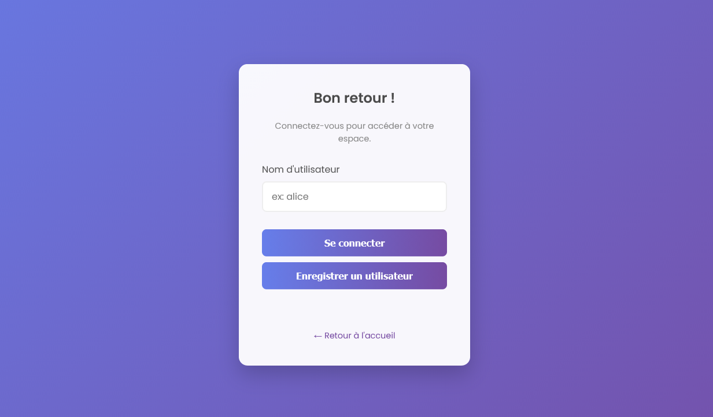

# Maintenance_exercice

### Alluin Edouard, Behani Julien

### groupe 2

**L'objectif de ce tp est de réaliser un site web avec un bug volontaire. Un bînome devra comprendre le fonctionnement du site, chercher le bug et repérer les failles de sécurité. Nous devrons faire deux même avec le projet du bînome.**

## Conception de notre site

Le site devait comporter 3 pages, la page de connexion, la page d'accueil et la page des produits. Pour cela nous avons fait une conception. Plus précisément un processus avec Bizagi en lien avec la page de connexion, si nous avons fait cette conception avec une page sur les trois c'est parce que le bug se trouve précisément ici. Mon collègue et moi avons eu besoin d'un Bizagi pour avoir un aperçue du fonctionnement de la page de connexion et facilité son développement. 

## Développement de notre site
Nous avons conçue premièrment un front en HTML-CSS pour obtenir un premier rendu sans le back. Nous avons ensuite développé le back pour la connexion et l'inscription au niveau du compte et l'affichage des produits. Nous avons fait en sorte de faire un design simple et moderne. Bien évidemment les fonctionnalité du site reste plutôt limité mais notre priorité sur le tp est de gérer la maintenance applicative. 

## Développement du bug volontaire

Comme je vous l'ai expliqué dans la conception du site. Nous avons volontairement créer un bug sur le site, précisément dans la page de connexion. Le bug vient du fait qu'on ne peut pas mettre un mot de passe en créant notre compte. On peut simplement créer notre compte ou se connecter seulement avec le nom d'utilisateur. Autrement dit, il n'y a aucune sécurité dans notre site pour la protection des comptes utilisateurs.    

## Débuggage du site d'un bînome

